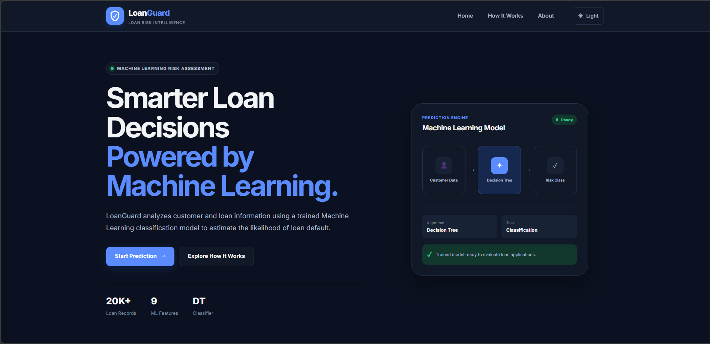
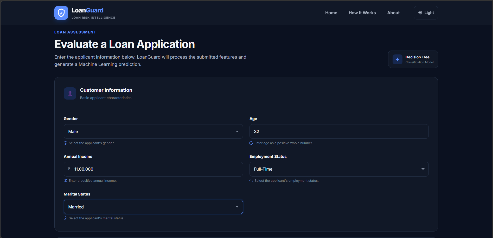
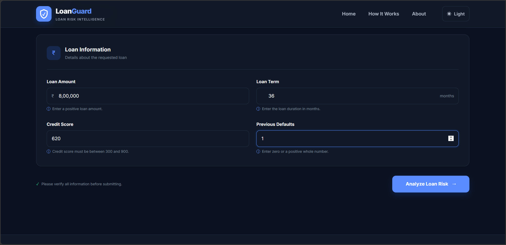
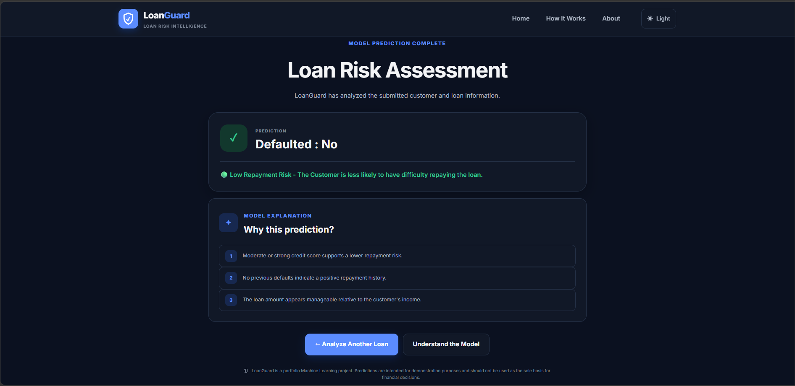
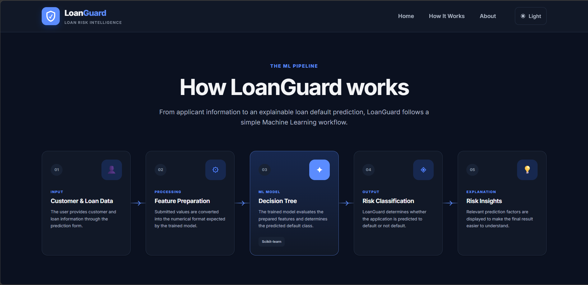
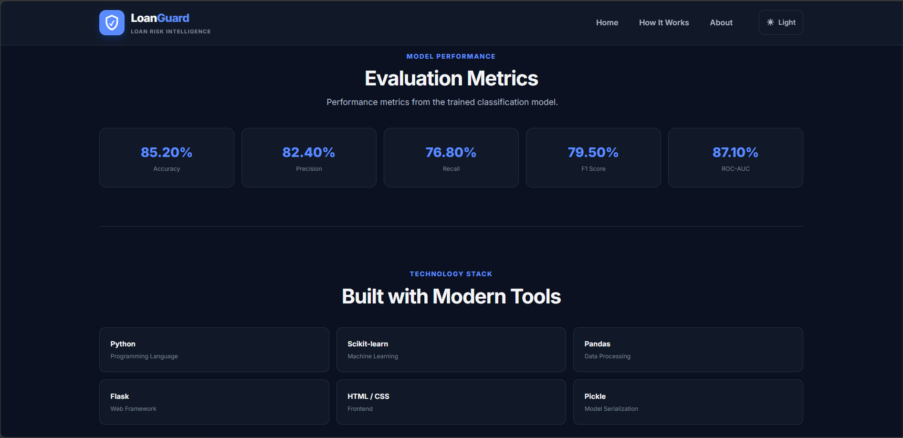

<!-- <p align="center">
  
</p>

<h1 align="center">LoanGuard</h1>

<p align="center">
  A Machine Learning-powered web application for loan default prediction.
</p> -->

# 🛡️ LoanGuard

> A Machine Learning-powered web application that predicts the likelihood of loan default based on customer and loan-related information.

LoanGuard helps assess whether a loan applicant is **more likely to default or not default** using a trained **Decision Tree Classifier**. The application provides an intuitive interface for entering customer and loan details, generates a risk classification, and presents relevant factors behind the prediction.

---

## ✨ Features

- 🧠 Machine Learning-based loan default prediction
- 🌳 Decision Tree Classifier
- 👤 Customer information input
- 💰 Loan information input
- 📊 Low-risk and high-risk classification
- 💡 Prediction-based risk insights
- 📈 Model performance metrics
- 🌓 Light and Dark theme support
- 📱 Responsive user interface
- 🎨 Modern and clean Flask-based interface

---

## 🛠️ Technology Stack

### Backend

- Python
- Flask

### Machine Learning

- Scikit-learn
- Decision Tree Classifier

### Data Processing

- Pandas
- NumPy

### Frontend

- HTML
- CSS
- JavaScript

### Model Serialization

- Pickle

---

## 🖥️ Application Screenshots

### 🏠 Home Page



### 👤 Customer Information



### 💰 Loan Information



### 📊 Prediction Result



### 🔄 How It Works



### 📈 Model Performance & Technology Stack



---

## 🔄 Project Workflow

```text
Customer & Loan Data
        ↓
Feature Preparation
        ↓
Decision Tree Classifier
        ↓
Loan Default Prediction
        ↓
Risk Classification
        ↓
Prediction Insights
```

---

## 📋 Model Input Features

The model evaluates the following nine customer and loan-related attributes:

1. Gender
2. Age
3. Income
4. Loan Amount
5. Loan Term
6. Credit Score
7. Employment Status
8. Marital Status
9. Previous Defaults

---

<!-- ## 📊 Model Performance

The trained Decision Tree Classifier achieved the following evaluation metrics:

| Metric    |  Score |
| --------- | -----: |
| Accuracy  | 85.20% |
| Precision | 82.40% |
| Recall    | 76.80% |
| F1 Score  | 79.50% |
| ROC-AUC   | 87.10% |

--- -->

## 📁 Project Folder Structure

```
LoanGuard/
│
├── app.py
│
├── models/
│   ├── model.py
│   ├── trained_model.pkl
│   └── metrics.json
│
├── templates/
│   ├── base.html
│   ├── index.html
│   ├── result.html
│   ├── how_it_works.html
│   └── about.html
│
├── static/
│   ├── style.css
│   └── script.js
│
├── screenshots/
│   ├── 01-home.png
│   ├── 02-customer-info.png
│   ├── 03-loan-info.png
│   ├── 04-result.png
│   ├── 05-how-it-works.png
│   ├── 06-about.png
│   └── 07-model-performance-and-technology-stack.png
│
├── requirements.txt
├── .gitignore
└── README.md
```

---

## 🚀 Installation

1. Clone the repository
```bash
git clone https://github.com/mukexh-m7/LoanGuard.git
```
2. Move into the project directory
```bash
cd LoanGuard
```
3. Create a virtual environment
```bash
python -m venv .venv
```
4. Activate the virtual environment
For Windows
```bash
.venv\Scripts\activate
```
For macOS / Linux
```bash
source .venv/bin/activate
```
5. Install dependencies
```bash
pip install -r requirements.txt
```
6. Run the application
```bash
python app.py
```

---

<!-- ## 🎯 Project Workflow

```
User Input
    ↓
Form Validation
    ↓
Feature Encoding
    ↓
Trained ML Model
    ↓
Default Prediction
    ↓
Risk Classification
    ↓
Prediction Explanation
```

--- -->

## 🧩 Prediction Classes

#### 🟢 Defaulted: No

- Lower Laon Repayment Risk

- The model predicts that the applicant is less likely to have difficulty repaying the loan based on the submitted information.

#### 🔴 Defaulted: Yes

- Higher Loan Repayment Risk

- The model predicts that the applicant may have a higher likelihood of experiencing repayment difficulties based on the submitted information.

---

## 🔮 Future Improvements

- Probability-based risk scoring
- SHAP-based model explainability
- Additional machine learning model comparison
- User authentication and prediction history
- Database integration
- Cloud deployment
- REST API support
- Advanced data visualization dashboard

---

## ⚠️ Disclaimer

- LoanGuard is a portfolio Machine Learning project created for educational and demonstration purposes.

- Predictions generated by the application should not be used as the sole basis for real-world financial or lending decisions.

---

## 👨‍💻 Author

 Mukesh Maharana
